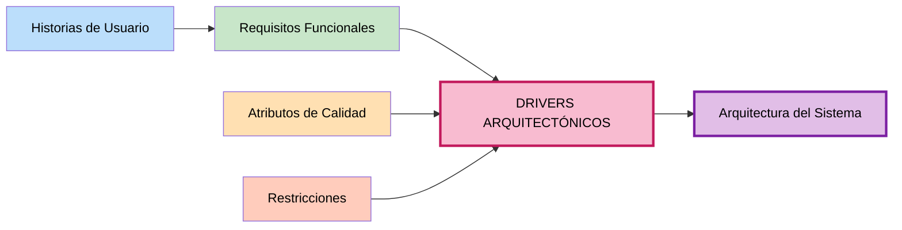

# Drivers Arquitectónicos — Marketplace de productos para mascotas

## Tabla de Drivers Arquitectónicos

| Driver | Problema que plantea | Decisión que responde |
| :--- | :--- | :--- |
| **DA01- Escalabilidad** | Aumentarán usuarios en campañas | Monolito modular con posibilidad de escalamiento horizontal |
| **DA02- Rendimiento** | Habrá alta concurrencia | Incorporar caché y optimizar comunicación/procesamiento |
| **DA03 -Seguridad** | Hay datos sensibles | Autenticación y autorización |
| **DA04 - Pago externo** | Hay que comunicarse con una pasarela | Integración mediante API y adaptadores |
| **DA05 -API REST** | Frontend/backend deben comunicarse mediante REST | Separar interfaz y backend mediante API REST |
| **DA06 - Mantenibilidad** | Cambios no deben afectar otros módulos | Modularidad + Clean Architecture |
---

## Matriz de relaciones
 

---

- **Escalabilidad:** Considerar load balancers, réplicas, caché
- **Rendimiento:** Optimizar queries, implementar índices, usar caché
- **Seguridad:** OAuth, JWT, HTTPS, encriptación, RBAC
- **Disponibilidad:** Redundancia, réplicas, health checks
- **Mantenibilidad:** Modularidad, documentación, pruebas, CI/CD

