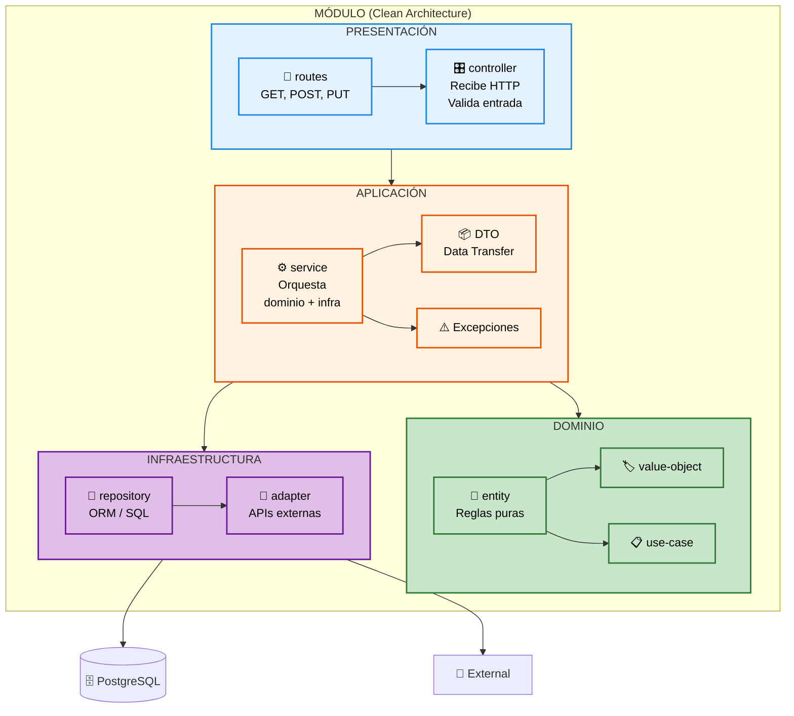

# Clean Architecture — Diagrama y Tabla

## Diagrama: Las 4 Capas

---

## Tabla: Capas y Responsabilidades

| Capa | Archivos | Responsabilidad | No Contiene |
|------|----------|-----------------|------------|
| **PRESENTACIÓN** | `*.routes.js`, `*.controller.js` | Recibir HTTP, validar entrada, responder JSON | Lógica de negocio |
| **APLICACIÓN** | `*.service.js`, `dtos/`, `exceptions/` | Orquestar dominio + infraestructura | Detalles técnicos (Express, ORM) |
| **DOMINIO** | `*.entity.js`, `*.value-object.js`, `*.use-case.js` | Reglas de negocio puras | Express, ORM, Base de datos |
| **INFRAESTRUCTURA** | `*.repository.js`, `*.adapter.js` | Persistencia, APIs externas, caché | Lógica de negocio |
