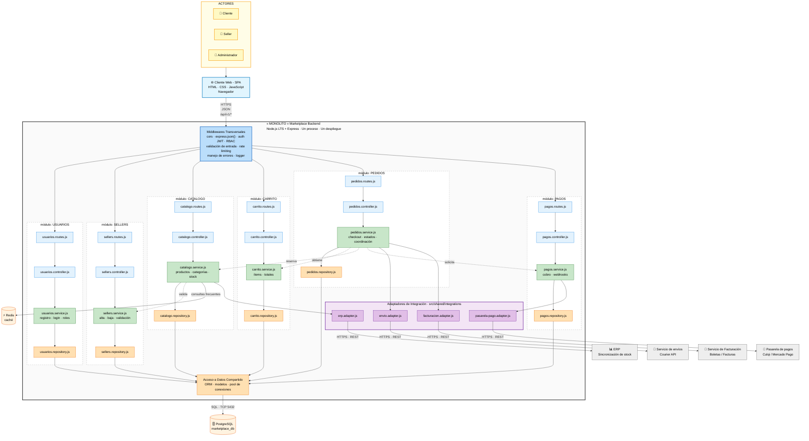
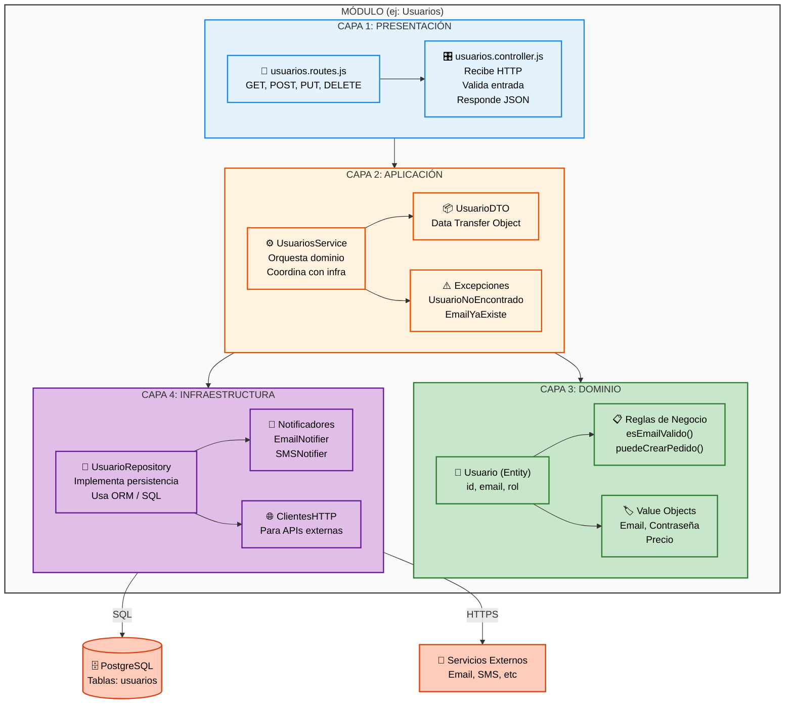
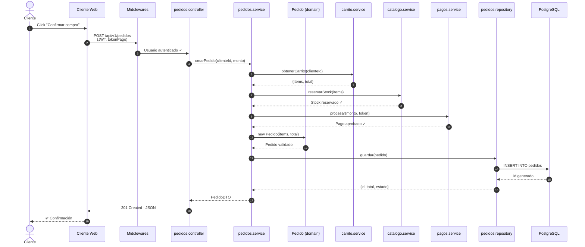
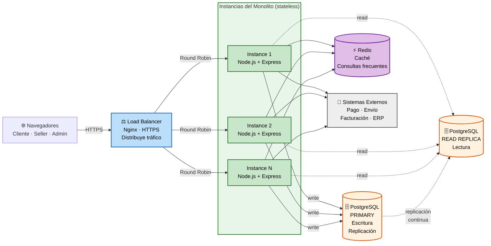

# Diagramas de Arquitectura — Monolito Modular en Capas

---

## DIAGRAMA 1: Arquitectura del Monolito (Visión Global)

Muestra la **estructura global del sistema**: actores, cliente web, monolito con sus 6 módulos, middlewares, adaptadores, bases de datos y sistemas externos.

## DIAGRAMA 2: Arquitectura en Capas (Visión Interna)

Muestra cómo está **organizado cada módulo internamente** en capas, siguiendo Clean Architecture.

### Explicación de las Capas

| Capa | Responsabilidad | No contiene | Ejemplo |
|------|-----------------|-------------|---------|
| **PRESENTACIÓN** | Recibir HTTP, validar entrada, responder JSON | Lógica de negocio | `POST /api/v1/usuarios/registro` |
| **APLICACIÓN** | Orquestar dominio + infraestructura, casos de uso | Detalles técnicos | `RegistrarUsuarioService.registrar()` |
| **DOMINIO** | Reglas de negocio puras, independiente | Express, ORM, BD | `Usuario.esEmailValido()` |
| **INFRAESTRUCTURA** | Detalles técnicos: ORM, APIs, caché | Lógica de negocio | `UsuarioRepository.guardar(usuario)` |

---

## DIAGRAMA 3: Flujo de Ejecución (Caso de Uso: Crear Pedido)

Muestra cómo interactúan las capas y los módulos durante el checkout (RF05).

---

## DIAGRAMA 4: Vista de Despliegue (Escalamiento Horizontal)

Muestra cómo se distribuye el monolito en producción con réplicas, load balancer y bases de datos.

