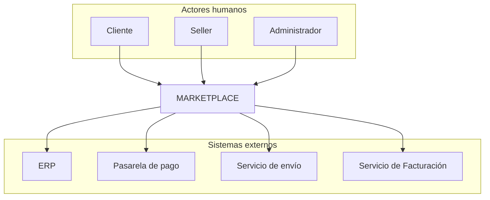

# Actores del Sistema — Marketplace de productos para mascotas

## Objetivo
Identificar a las personas, organizaciones y sistemas externos que interactúan con el Marketplace, determinando qué necesita realizar cada uno.

## Tabla de actores

| Actor | ¿Qué necesita realizar? |
|---|---|
| **Cliente** | Buscar productos, consultar información, agregar productos al carrito, realizar pedidos, efectuar el pago y consultar sus pedidos. |
| **Seller** | Ofrecer productos, registrar productos, actualizar productos, consultar sus productos y gestionar la información relacionada con sus ventas. |
| **Administrador** | Administrar la plataforma (gestionar sellers, usuarios y configuración general del sistema). |
| **Pasarela de pago** | Procesar pagos generados por las compras realizadas en el Marketplace. |
| **Servicio de envío** | Gestionar la información de entrega de los pedidos. |
| **Servicio de Facturación** | Generar comprobantes de pago (boletas/facturas) por cada compra realizada. |
| **ERP** | Proporcionar información de productos y stock disponible. |

## Clasificación

**Actores humanos**
- Cliente
- Seller
- Administrador

**Sistemas externos**
- Pasarela de pago
- Servicio de envío
- Servicio de Facturación
- ERP

## Diagrama de contexto

