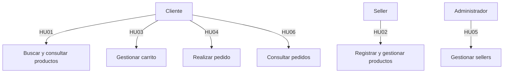

# Historias de Usuario — Marketplace de productos para mascotas

## Objetivo
Describir las principales necesidades de los usuarios desde su perspectiva. Utilizar el formato:
**Como [actor], quiero [acción], para [beneficio].**

## Tabla de historias de usuario

| ID | Historia de usuario |
|---|---|
| **HU01** | Como cliente, quiero buscar y consultar productos, para encontrar el producto que necesito. |
| **HU02** | Como seller, quiero registrar y gestionar mis productos, para ofrecerlos a los clientes. |
| **HU03** | Como cliente, quiero gestionar los productos de mi carrito, para preparar los productos que deseo comprar. |
| **HU04** | Como cliente, quiero realizar un pedido con los productos de mi carrito, para completar mi compra. |
| **HU05** | Como administrador, quiero gestionar los sellers de la plataforma, para administrar a los vendedores registrados. |
| **HU06** | Como cliente, quiero consultar mis pedidos y su estado, para conocer el estado de mis compras. |

## Detalles de las historias

### HU01 — Buscar y consultar productos
- **Actor:** Cliente
- **Acción:** Buscar y consultar productos
- **Beneficio:** Encontrar el producto que necesito

### HU02 — Gestionar productos
- **Actor:** Seller
- **Acción:** Registrar y gestionar mis productos
- **Beneficio:** Ofrecerlos a los clientes

### HU03 — Gestionar carrito
- **Actor:** Cliente
- **Acción:** Gestionar los productos de mi carrito
- **Beneficio:** Preparar los productos que deseo comprar

### HU04 — Realizar pedido
- **Actor:** Cliente
- **Acción:** Realizar un pedido con los productos de mi carrito
- **Beneficio:** Completar mi compra

### HU05 — Gestionar sellers
- **Actor:** Administrador
- **Acción:** Gestionar los sellers de la plataforma
- **Beneficio:** Administrar a los vendedores registrados

### HU06 — Consultar pedidos
- **Actor:** Cliente
- **Acción:** Consultar mis pedidos y su estado
- **Beneficio:** Conocer el estado de mis compras

## Diagrama de actores y sus historias

## Relación con requisitos funcionales (próximo paso)

Estas historias de usuario servirán como base para identificar los requisitos funcionales (RF) que el sistema debe implementar. Cada historia se descompondrá en una o más funcionalidades específicas en el Ejercicio 05.