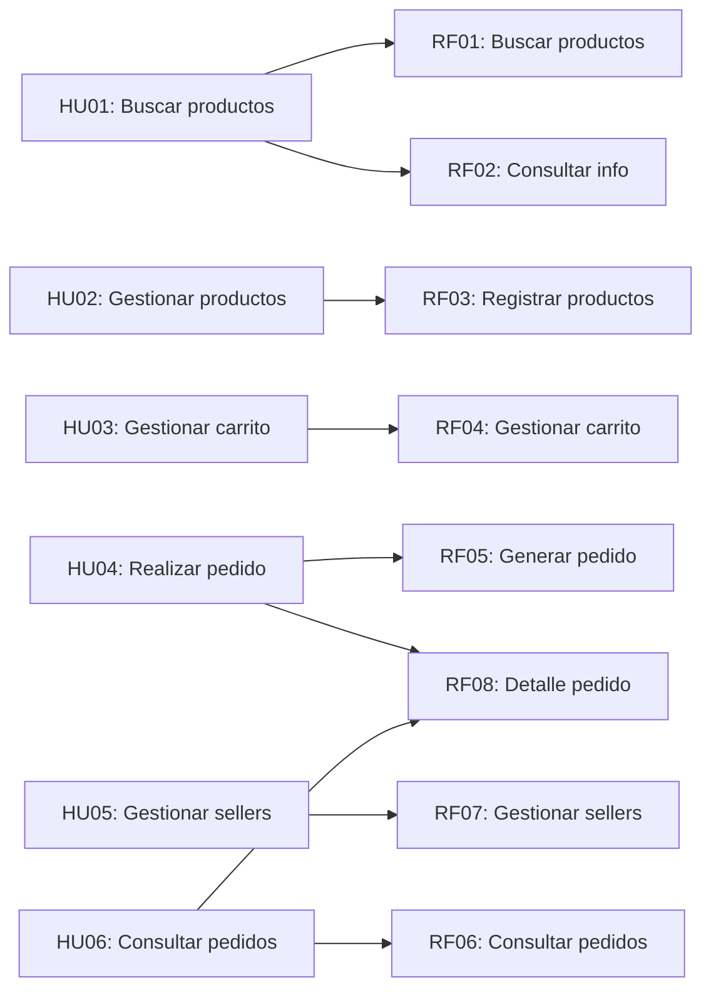

# Requisitos Funcionales — Marketplace de productos para mascotas

## Objetivo
Identificar y documentar las funcionalidades que el sistema debe proporcionar, derivadas de las historias de usuario.

## Diferencia importante

| Concepto | Definición |
|---|---|
| **Historia de usuario** | Expresa la necesidad desde el punto de vista del usuario. |
| **Requisito funcional** | Expresa lo que el sistema debe hacer para satisfacer esa necesidad. |

---

## Requisitos Funcionales

| ID | Requisito funcional |
|---|---|
| **RF01** | El sistema debe permitir buscar productos mediante criterios de búsqueda. |
| **RF02** | El sistema debe permitir consultar la información y disponibilidad de los productos. |
| **RF03** | El sistema debe permitir registrar y actualizar productos en la plataforma. |
| **RF04** | El sistema debe permitir agregar, modificar y eliminar productos del carrito de compra. |
| **RF05** | El sistema debe permitir generar un pedido a partir de los productos del carrito. |
| **RF06** | El sistema debe permitir consultar los pedidos realizados y su estado. |
| **RF07** | El sistema debe permitir registrar, actualizar y desactivar sellers de la plataforma. |
| **RF08** | El sistema debe permitir consultar el detalle de un pedido realizado. |

---

## Relación entre Historias de Usuario y Requisitos Funcionales

| Historia de usuario | Requisitos funcionales relacionados |
|---|---|
| **HU01** Buscar y consultar productos | RF01, RF02 |
| **HU02** Gestionar productos | RF03 |
| **HU03** Gestionar carrito | RF04 |
| **HU04** Realizar pedido | RF05, RF08 |
| **HU05** Gestionar sellers | RF07 |
| **HU06** Consultar pedidos | RF06, RF08 |

---

## Detalles de los Requisitos Funcionales

### RF01 — Buscar productos
- **Descripción:** El sistema debe permitir buscar productos mediante criterios de búsqueda.
- **Historia relacionada:** HU01
- **Criterios de aceptación:**
  - El cliente puede ingresar palabras clave para buscar productos
  - El sistema retorna una lista de productos que coinciden con los criterios

### RF02 — Consultar información de productos
- **Descripción:** El sistema debe permitir consultar la información y disponibilidad de los productos.
- **Historia relacionada:** HU01
- **Criterios de aceptación:**
  - El cliente puede ver detalles completos de un producto (descripción, precio, disponibilidad)
  - El sistema muestra si el producto está disponible en stock

### RF03 — Registrar y actualizar productos
- **Descripción:** El sistema debe permitir registrar y actualizar productos en la plataforma.
- **Historia relacionada:** HU02
- **Criterios de aceptación:**
  - El seller puede crear un nuevo producto
  - El seller puede actualizar la información de sus productos
  - La información incluye descripción, precio, categoría y stock

### RF04 — Gestionar carrito
- **Descripción:** El sistema debe permitir agregar, modificar y eliminar productos del carrito de compra.
- **Historia relacionada:** HU03
- **Criterios de aceptación:**
  - El cliente puede agregar productos al carrito
  - El cliente puede modificar la cantidad de productos
  - El cliente puede eliminar productos del carrito
  - El carrito muestra el total de la compra

### RF05 — Generar pedido
- **Descripción:** El sistema debe permitir generar un pedido a partir de los productos del carrito.
- **Historia relacionada:** HU04
- **Criterios de aceptación:**
  - El cliente puede confirmar su pedido desde el carrito
  - El sistema crea un registro del pedido
  - El pedido incluye información del cliente, productos y total

### RF06 — Consultar pedidos
- **Descripción:** El sistema debe permitir consultar los pedidos realizados y su estado.
- **Historia relacionada:** HU06
- **Criterios de aceptación:**
  - El cliente puede ver una lista de sus pedidos
  - El sistema muestra el estado actual de cada pedido (pendiente, procesando, enviado, entregado)
  - El cliente puede ver el historial de sus compras

### RF07 — Gestionar sellers
- **Descripción:** El sistema debe permitir registrar, actualizar y desactivar sellers de la plataforma.
- **Historia relacionada:** HU05
- **Criterios de aceptación:**
  - El administrador puede registrar nuevos sellers
  - El administrador puede ver información de los sellers
  - El administrador puede desactivar sellers si es necesario

### RF08 — Consultar detalle de pedido
- **Descripción:** El sistema debe permitir consultar el detalle de un pedido realizado.
- **Historia relacionada:** HU04, HU06
- **Criterios de aceptación:**
  - El cliente puede ver todos los detalles de un pedido específico
  - Incluye productos, precios, estado de envío y dirección de entrega

---

## Diagrama de trazabilidad

---

## Próximos pasos

Los requisitos funcionales servirán como base para:
1. **Ejercicio 06:** Identificar atributos de calidad
2. **Ejercicio 07:** Identificar restricciones
3. **Ejercicio 08:** Identificar drivers arquitectónicos
4. **Ejercicio 09:** Diseñar la arquitectura en capas