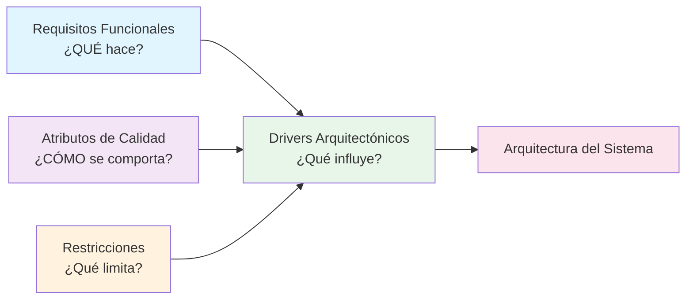

# Atributos de Calidad — Marketplace de productos para mascotas

## Objetivo
Determinar cómo debe comportarse el sistema, además de qué debe hacer. Identificar las características que indican la calidad del sistema más allá de sus funcionalidades.

## Escenario de contexto

Durante una campaña comercial, el Marketplace podría recibir una gran cantidad de usuarios consultando productos y realizando compras simultáneamente. ¿Qué atributos de calidad resultan importantes?

---

## Tabla de Atributos de Calidad

| ID | Atributo de calidad | Escenario de calidad |
|---|---|---|
| **AC01** | **Rendimiento** | Las consultas de productos y operaciones del carrito deben responder rápidamente incluso cuando exista una alta cantidad de usuarios concurrentes. |
| **AC02** | **Disponibilidad** | El sistema debe permanecer disponible durante la campaña comercial y permitir que los usuarios realicen sus operaciones. |
| **AC03** | **Escalabilidad** | El sistema debe poder soportar un incremento de usuarios y solicitudes sin afectar significativamente su funcionamiento. |
| **AC04** | **Seguridad** | Los datos de los usuarios, cuentas y operaciones de compra deben estar protegidos frente a accesos no autorizados. |
| **AC05** | **Mantenibilidad** | El sistema debe estar organizado de manera que permita realizar cambios y correcciones sin afectar innecesariamente otras funcionalidades. |

---

## Detalle de los Atributos de Calidad

### AC01 — Rendimiento ⚡

**¿Qué significa?**  
Capacidad de responder adecuadamente ante las solicitudes de los usuarios.

**Escenario de calidad:**  
Las consultas de productos y operaciones del carrito deben responder rápidamente incluso cuando exista una alta cantidad de usuarios concurrentes.

**Criterios de éxito:**
- Las búsquedas de productos deben retornar resultados en menos de 2 segundos
- Las operaciones del carrito deben procesarse en menos de 1 segundo
- El sistema debe soportar al menos 1,000 usuarios concurrentes sin degradación significativa
- Los tiempos de respuesta no deben aumentar más del 20% durante picos de tráfico

**Impacto en la arquitectura:**
- Uso de caché para datos frecuentemente consultados
- Optimización de queries a la base de datos
- Implementación de índices en tablas críticas
- Consideración de CDN para contenido estático

---

### AC02 — Disponibilidad ⏰

**¿Qué significa?**  
Capacidad de estar disponible cuando se necesita.

**Escenario de calidad:**  
El sistema debe permanecer disponible durante la campaña comercial y permitir que los usuarios realicen sus operaciones.

**Criterios de éxito:**
- El sistema debe tener una disponibilidad del 99.5% o superior
- Máximo 4 horas de inactividad al mes
- Recuperación automática de fallos en menos de 5 minutos
- No debe haber pérdida de datos en caso de fallos

**Impacto en la arquitectura:**
- Implementación de redundancia en componentes críticos
- Réplicas de la base de datos (master-slave o multi-master)
- Sistema de monitoring y alertas
- Planes de recuperación ante desastres

---

### AC03 — Escalabilidad 📈

**¿Qué significa?**  
Capacidad de crecer sin afectar significativamente el funcionamiento.

**Escenario de calidad:**  
El sistema debe poder soportar un incremento de usuarios y solicitudes sin afectar significativamente su funcionamiento.

**Criterios de éxito:**
- El sistema puede duplicar la carga sin cambios significativos en la arquitectura
- Escalado horizontal: agregar más servidores debe mejorar el rendimiento
- Incremento de usuarios del 100% debe resultar en degradación menor al 10%
- Capacidad de soportar picos de tráfico temporales sin afectar usuarios normales

**Impacto en la arquitectura:**
- Arquitectura de microservicios o modular
- Load balancers para distribuir carga
- Bases de datos escalables (sharding, particionamiento)
- Arquitectura sin estado (stateless) en servidores
- Implementación de colas de mensajes para procesamiento asíncrono

---

### AC04 — Seguridad 🔒

**¿Qué significa?**  
Protección de información y acceso a recursos.

**Escenario de calidad:**  
Los datos de los usuarios, cuentas y operaciones de compra deben estar protegidos frente a accesos no autorizados.

**Criterios de éxito:**
- Autenticación requerida para todas las operaciones sensibles
- Encriptación de datos en tránsito (HTTPS/TLS)
- Encriptación de datos sensibles en reposo (contraseñas, datos bancarios)
- Implementación de control de acceso basado en roles (RBAC)
- Auditoría y logging de todas las operaciones críticas
- Cumplimiento con estándares de seguridad (OWASP Top 10)

**Impacto en la arquitectura:**
- Implementación de OAuth 2.0 o JWT para autenticación
- HTTPS obligatorio en todas las comunicaciones
- Hashing seguro de contraseñas (bcrypt, argon2)
- Firewalls y sistemas de detección de intrusiones
- Validación y sanitización de entrada de datos
- Rate limiting para prevenir ataques de fuerza bruta

---

### AC05 — Mantenibilidad 🔧

**¿Qué significa?**  
Facilidad para modificar y mantener el sistema.

**Escenario de calidad:**  
El sistema debe estar organizado de manera que permita realizar cambios y correcciones sin afectar innecesariamente otras funcionalidades.

**Criterios de éxito:**
- Código modular y desacoplado
- Documentación clara y actualizada
- Pruebas automatizadas (unit tests, integration tests)
- Cobertura de código de al menos 70%
- Cambios en un módulo no deben romper otros módulos
- Facilidad para agregar nuevas funcionalidades

**Impacto en la arquitectura:**
- Separación de responsabilidades (capas: presentación, lógica, datos)
- Interfaces bien definidas entre componentes
- Principios SOLID aplicados
- Documentación de arquitectura y decisiones
- Sistema de versionamiento y CI/CD
- Logs estructurados para facilitar debugging

---

## Diferencia entre Requisito Funcional y Atributo de Calidad

| Aspecto | Requisito Funcional | Atributo de Calidad |
|---|---|---|
| **¿Qué pregunta responde?** | ¿Qué debe hacer el sistema? | ¿Cómo debe comportarse el sistema? |
| **Ejemplo funcional** | El sistema debe permitir realizar pagos. | — |
| **Ejemplo de calidad** | — | El proceso de pago debe ser seguro y responder adecuadamente. |

---

## Relación con otros elementos

---

## Resumen

| ID | Atributo | Importancia | Impacto en Arquitectura |
|---|---|---|---|
| AC01 | Rendimiento | **Alta** | Caché, índices, optimización |
| AC02 | Disponibilidad | **Alta** | Redundancia, recuperación |
| AC03 | Escalabilidad | **Alta** | Modularidad, load balancing |
| AC04 | Seguridad | **Crítica** | Autenticación, encriptación |
| AC05 | Mantenibilidad | **Media-Alta** | Modularidad, documentación |

---

## Próximos pasos

Los atributos de calidad contribuirán a definir:
1. **Ejercicio 07:** Restricciones
2. **Ejercicio 08:** Drivers arquitectónicos
3. **Ejercicio 09:** Diseño de la arquitectura en capas