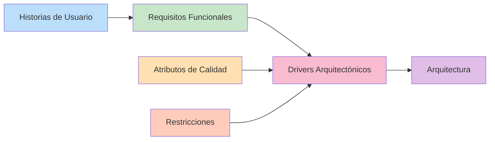

# Restricciones — Marketplace de productos para mascotas

## Objetivo
Identificar las restricciones que condicionan las decisiones de diseño y arquitectura del sistema. Restricciones pueden ser tecnológicas, organizacionales, legales o del proyecto.

## Definición

**Restricciones:** Son condiciones, reglas o limitaciones que deben respetarse durante el desarrollo del sistema y que influyen significativamente en cómo se diseña la arquitectura.

---

## Tabla de Restricciones

| ID | Restricción | Descripción |
|---|---|---|
| **RC01** | Aplicación web | El sistema debe desarrollarse como una aplicación accesible mediante un navegador web. |
| **RC02** | Control de versiones | El código fuente debe gestionarse utilizando Git y mantenerse en un repositorio compartido. |
| **RC03** | API REST | La comunicación entre el frontend y los servicios del sistema debe realizarse mediante una API REST. |
| **RC04** | Pasarela de pago | El sistema debe integrarse con una pasarela de pago externa para procesar las operaciones de pago. |
| **RC05** | Servicio de envío | El sistema debe integrarse con un servicio externo de envío para gestionar la información relacionada con la entrega de pedidos. |
| **RC06** | Framework backend | El backend debe desarrollarse utilizando Node.js. |
| **RC07** | Base de datos | La información debe almacenarse en PostgreSQL. |
| **RC08** | Integración con ERP | El sistema debe integrarse con un ERP existente para obtener información de productos y stock. |
| **RC09** | Autenticación | El sistema debe implementar un mecanismo de autenticación seguro para usuarios, sellers y administradores. |
| **RC10** | Licencia de software | El proyecto debe utilizar únicamente software de código abierto o con licencias compatibles. |

---

## Detalle de las Restricciones

### RC01 — Aplicación web 🌐

**Tipo:** Tecnológica  
**Descripción:** El sistema debe desarrollarse como una aplicación accesible mediante un navegador web.

**Implicaciones:**
- Frontend debe ser compatible con navegadores modernos (Chrome, Firefox, Safari, Edge)
- Interfaz debe ser responsiva y funcionar en dispositivos móviles
- No se desarrollarán aplicaciones de escritorio o móvil nativa en esta etapa
- Accesibilidad web debe cumplir con estándares WCAG 2.1

**Impacto en la arquitectura:**
- Uso de tecnologías web estándar (HTML, CSS, JavaScript)
- Frameworks frontend compatibles (React, Vue, Angular, etc.)

---

### RC02 — Control de versiones 📝

**Tipo:** Organizacional  
**Descripción:** El código fuente debe gestionarse utilizando Git y mantenerse en un repositorio compartido.

**Implicaciones:**
- Todos los cambios deben ser versionados en Git
- Repositorio debe alojarse en una plataforma como GitHub, GitLab o Bitbucket
- Cada miembro del equipo debe seguir convenciones de commits consistentes
- Rama main/master debe contener código funcional y estable

**Impacto en la arquitectura:**
- Establecimiento de flujos de trabajo (Git Flow, GitHub Flow)
- Política de pull requests y code reviews
- Integración continua (CI/CD)

---

### RC03 — API REST 🔌

**Tipo:** Tecnológica  
**Descripción:** La comunicación entre el frontend y los servicios del sistema debe realizarse mediante una API REST.

**Implicaciones:**
- Backend debe exponer endpoints REST para todas las operaciones
- Uso de métodos HTTP estándar (GET, POST, PUT, DELETE)
- Respuestas en formato JSON
- Versionamiento de API (v1, v2, etc.)
- Documentación de API con Swagger/OpenAPI

**Impacto en la arquitectura:**
- Separación clara entre frontend y backend
- Facilita integraciones con terceros
- Permite reutilizar backend desde múltiples clientes
- Escalabilidad independiente de frontend y backend

---

### RC04 — Pasarela de pago 💳

**Tipo:** Tecnológica  
**Descripción:** El sistema debe integrarse con una pasarela de pago externa para procesar las operaciones de pago.

**Implicaciones:**
- No se almacenarán datos sensibles de tarjetas en la base de datos local
- Cumplimiento con PCI DSS (Payment Card Industry Data Security Standard)
- Integración con APIs de pasarelas reconocidas (Stripe, PayPal, Mercado Pago, etc.)
- Manejo seguro de tokens de transacciones
- Notificaciones de webhooks para actualizar estado de pagos

**Impacto en la arquitectura:**
- Módulo específico para gestionar integraciones de pago
- Encriptación de comunicaciones con la pasarela
- Logging de transacciones para auditoría

---

### RC05 — Servicio de envío 🚚

**Tipo:** Tecnológica  
**Descripción:** El sistema debe integrarse con un servicio externo de envío para gestionar la información relacionada con la entrega de pedidos.

**Implicaciones:**
- Integración con APIs de courier/servicio de envío
- Sincronización de estados de envío en tiempo real
- Generación de etiquetas de envío
- Seguimiento de paquetes desde el sistema

**Impacto en la arquitectura:**
- Módulo dedicado a gestión de envíos
- Webhooks para recibir actualizaciones de estado
- Sincronización automática con la base de datos local

---

### RC06 — Framework backend 🖥️

**Tipo:** Tecnológica  
**Descripción:** El backend debe desarrollarse utilizando Node.js.

**Implicaciones:**
- Uso de tecnologías basadas en Node.js (Express, Nest.js, Fastify, etc.)
- Developers deben tener experiencia con JavaScript/TypeScript
- Uso de npm o yarn para gestión de dependencias
- Runtime Node.js en servidores de producción

**Impacto en la arquitectura:**
- Arquitectura orientada a eventos (event-driven)
- Uso de operaciones asincrónicas (async/await, promises)
- Facilita integración con servicios de terceros mediante librerías npm

---

### RC07 — Base de datos 🗄️

**Tipo:** Tecnológica  
**Descripción:** La información debe almacenarse en PostgreSQL.

**Implicaciones:**
- Uso exclusivo de PostgreSQL como base de datos principal
- Cumplimiento con normativas de protección de datos
- Backups regulares y replicación de BD
- Optimización de queries y índices
- Herramientas de migración (Flyway, Liquibase, etc.)

**Impacto en la arquitectura:**
- Diseño normalizado de base de datos
- Uso de transactions ACID para integridad de datos
- Separación de réplicas de lectura si es necesario
- PostGIS si se requiere funcionalidades geoespaciales

---

### RC08 — Integración con ERP 🔗

**Tipo:** Tecnológica  
**Descripción:** El sistema debe integrarse con un ERP existente para obtener información de productos y stock.

**Implicaciones:**
- Consumo de APIs del ERP o exportación de datos
- Sincronización periódica de catálogo de productos
- Sincronización de niveles de stock en tiempo real o casi real
- Manejo de conflictos de datos entre sistemas

**Impacto en la arquitectura:**
- Módulo de integración con ERP
- Colas de mensajes para sincronización asincrónica
- Caché de datos de productos para rendimiento
- Logging de sincronizaciones para auditoría

---

### RC09 — Autenticación 🔐

**Tipo:** Tecnológica  
**Descripción:** El sistema debe implementar un mecanismo de autenticación seguro para usuarios, sellers y administradores.

**Implicaciones:**
- Autenticación por usuario/contraseña con hash seguro
- Implementación de 2FA (autenticación de dos factores) opcional
- Sesiones seguras o tokens JWT
- Recuperación de contraseña segura
- Roles y permisos diferenciados (cliente, seller, admin)

**Impacto en la arquitectura:**
- Módulo dedicado a autenticación y autorización
- Middleware de validación de tokens
- Control de acceso basado en roles (RBAC)
- Logs de acceso para seguridad

---

### RC10 — Licencia de software 📜

**Tipo:** Organizacional/Legal  
**Descripción:** El proyecto debe utilizar únicamente software de código abierto o con licencias compatibles.

**Implicaciones:**
- Auditoría de licencias de todas las dependencias
- Prohibición de software privado o con licencias restrictivas
- Documentación de licencias en el proyecto (LICENSE.md)
- Cumplimiento con GPL, MIT, Apache, BSD, etc.

**Impacto en la arquitectura:**
- Selección cuidadosa de frameworks y librerías
- Uso de herramientas de análisis de licencias
- Documentación transparente de dependencias

---

## Diferencia entre Restricción y Atributo de Calidad

| Aspecto | Restricción | Atributo de Calidad |
|---|---|---|
| **¿Qué es?** | Limitación o condición impuesta | Característica deseable del sistema |
| **¿Quién la define?** | Equipo, cliente, organización | Requisitos del negocio |
| **¿Es obligatoria?** | Sí, debe respetarse | Sí, pero con flexibilidad |
| **Ejemplo** | "Usar Node.js" | "El sistema debe ser escalable" |

---

## Relación entre elementos

---

## Matriz de Restricciones por Tipo

| Tipo | Restricciones | Cantidad |
|---|---|---|
| **Tecnológicas** | RC01, RC03, RC04, RC05, RC06, RC07, RC08, RC09 | 8 |
| **Organizacionales** | RC02, RC10 | 2 |
| **Legales** | Implícitas en RC04 (PCI DSS), seguridad de datos | — |

---

## Resumen

Las **10 restricciones identificadas** son de naturaleza **técnica, organizacional y legal**, y todas ellas impactarán significativamente en las decisiones arquitectónicas que se tomen en los ejercicios posteriores.

---

## Próximos pasos

Las restricciones contribuirán a definir:
1. **Ejercicio 08:** Drivers arquitectónicos
2. **Ejercicio 09:** Diseño de la arquitectura en capas
3. **Ejercicio 10:** Diagrama final de arquitectura