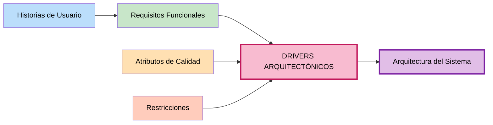

# Drivers Arquitectónicos — Marketplace de productos para mascotas

## Objetivo
Integrar los elementos identificados anteriormente (requisitos funcionales, atributos de calidad y restricciones) y determinar cuáles tienen una **influencia significativa** en las decisiones de arquitectura.

## Definición

**Drivers Arquitectónicos:** Son los requisitos funcionales, atributos de calidad y restricciones que influyen de manera importante en cómo se diseñará la arquitectura del sistema.

---

## Pregunta clave

**¿Qué requisito o condición puede cambiar la forma en que diseñamos la arquitectura?**

---

## Método para identificar Drivers Arquitectónicos

### Para Requisitos Funcionales:
- ¿Esta funcionalidad requiere una decisión importante de arquitectura?
- ¿Qué requisito puede cambiar la forma en que diseñamos la arquitectura?

### Para Atributos de Calidad:
- ¿Este atributo afecta la estructura o funcionamiento de la arquitectura?
- ¿Qué condición de calidad puede cambiar la forma en que diseñamos la arquitectura?

### Para Restricciones:
- ¿Esta condición limita o determina una decisión arquitectónica?

---

## Tabla de Drivers Arquitectónicos

| ID | Driver arquitectónico | Origen | ¿Por qué influye en la arquitectura? |
|---|---|---|---|
| **DA01** | El sistema debe soportar un incremento importante de usuarios durante campañas comerciales. | AC03 — Escalabilidad | Puede influir en la estrategia de escalamiento y despliegue. |
| **DA02** | El sistema debe mantener tiempos de respuesta adecuados durante una alta concurrencia. | AC01 — Rendimiento | Puede influir en la comunicación entre componentes, procesamiento y almacenamiento. |
| **DA03** | El sistema debe proteger los datos de usuarios y operaciones de compra. | AC04 — Seguridad | Puede influir en autenticación, autorización y protección de datos. |
| **DA04** | El sistema debe integrarse con una pasarela de pago externa mediante una API. | RC04 — Pasarela de pago | Condiciona la forma de comunicación e integración con servicios externos. |
| **DA05** | El sistema debe utilizar una API REST para la comunicación entre frontend y backend. | RC03 — API REST | Limita las alternativas de comunicación entre las partes del sistema. |
| **DA06** | El sistema debe desarrollarse con Node.js y PostgreSQL. | RC06, RC07 — Framework y BD | Define el stack tecnológico y las herramientas disponibles. |
| **DA07** | El sistema debe permanecer disponible durante campaña comercial. | AC02 — Disponibilidad | Influye en redundancia, recuperación ante fallos y estrategia de despliegue. |
| **DA08** | El sistema debe estar organizado de manera mantenible. | AC05 — Mantenibilidad | Influye en modularidad, separación de responsabilidades y documentación. |

---

## Detalle de los Drivers Arquitectónicos

### DA01 — Escalabilidad 📈

**Origen:** AC03 (Atributo de calidad)

**Enunciado:** El sistema debe soportar un incremento importante de usuarios durante campañas comerciales.

**¿Por qué influye?**
- Determina la estrategia de escalamiento (horizontal vs vertical)
- Define si usamos load balancers, réplicas de BD, caché distribuido
- Afecta decisiones sobre estado (stateful vs stateless)

**Decisiones arquitectónicas derivadas:**
- Arquitectura modular y desacoplada
- Escalado horizontal (agregar más servidores)
- Implementación de caché distribuido (Redis)
- Separación de responsabilidades en microservicios
- Colas de mensajes para procesamiento asíncrono
- Réplicas de lectura en base de datos

---

### DA02 — Rendimiento ⚡

**Origen:** AC01 (Atributo de calidad)

**Enunciado:** El sistema debe mantener tiempos de respuesta adecuados durante una alta concurrencia.

**¿Por qué influye?**
- Determina cómo comunicarse entre componentes
- Afecta estrategias de caching y optimización
- Define necesidad de índices y optimización de queries

**Decisiones arquitectónicas derivadas:**
- Implementación de caché (cliente, servidor, CDN)
- Optimización de queries a base de datos
- Índices en tablas críticas
- Compresión de datos en tránsito
- Procesamiento asincrónico para operaciones lentas
- Usar conexión pooling en base de datos
- Implementar paginación en consultas grandes

---

### DA03 — Seguridad 🔒

**Origen:** AC04 (Atributo de calidad)

**Enunciado:** El sistema debe proteger los datos de usuarios y operaciones de compra.

**¿Por qué influye?**
- Determina mecanismos de autenticación y autorización
- Afecta cómo se almacenan y transmiten datos sensibles
- Define necesidad de auditoría y logging

**Decisiones arquitectónicas derivadas:**
- Implementación de OAuth 2.0 o JWT para tokens
- HTTPS obligatorio en todas las comunicaciones
- Encriptación de datos en tránsito (TLS)
- Encriptación de datos sensibles en reposo
- Hashing seguro de contraseñas (bcrypt, argon2)
- Control de acceso basado en roles (RBAC)
- Auditoría y logging de operaciones críticas
- Validación y sanitización de entrada de datos
- Rate limiting para prevenir ataques

---

### DA04 — Integración con Pasarela de Pago 💳

**Origen:** RC04 (Restricción)

**Enunciado:** El sistema debe integrarse con una pasarela de pago externa mediante una API.

**¿Por qué influye?**
- Determina forma de comunicación con sistemas externos
- Afecta cómo se manejan transacciones y confirmaciones
- Define necesidad de webhooks y sincronización

**Decisiones arquitectónicas derivadas:**
- Módulo específico para gestión de pagos
- Implementación de webhooks para recibir confirmaciones
- Manejo de reintentos para operaciones fallidas
- Encriptación de comunicaciones con la pasarela
- No almacenar datos sensibles de tarjetas localmente
- Logging de todas las transacciones
- Cumplimiento con PCI DSS

---

### DA05 — API REST 🔌

**Origen:** RC03 (Restricción)

**Enunciado:** El sistema debe utilizar una API REST para la comunicación entre frontend y backend.

**¿Por qué influye?**
- Determina forma de comunicación entre componentes
- Afecta estructura de servicios backend
- Define necesidad de documentación (Swagger/OpenAPI)

**Decisiones arquitectónicas derivadas:**
- Separación clara entre frontend y backend
- Backend expone endpoints REST con métodos HTTP estándar
- Respuestas en formato JSON
- Versionamiento de API (v1, v2, etc.)
- Documentación con Swagger/OpenAPI
- Implementación de CORS si es necesario
- Rate limiting en endpoints
- Validación de entrada en cada endpoint

---

### DA06 — Stack Tecnológico 🖥️

**Origen:** RC06, RC07 (Restricciones)

**Enunciado:** El sistema debe desarrollarse con Node.js y PostgreSQL.

**¿Por qué influye?**
- Define las herramientas y frameworks disponibles
- Afecta decisiones sobre patrones y arquitectura
- Limita alternativas tecnológicas

**Decisiones arquitectónicas derivadas:**
- Uso de frameworks Node.js (Express, Nest.js, Fastify)
- Operaciones asincrónicas (async/await, promises)
- npm o yarn para gestión de dependencias
- TypeScript para mejorar seguridad de tipos
- Uso de ORM (Sequelize, TypeORM) o query builder (Knex.js) para PostgreSQL
- Migración de base de datos con herramientas como Flyway o Liquibase
- Aprovechamiento de características de PostgreSQL (JSON, arrays, etc.)

---

### DA07 — Disponibilidad ⏰

**Origen:** AC02 (Atributo de calidad)

**Enunciado:** El sistema debe permanecer disponible durante campaña comercial.

**¿Por qué influye?**
- Determina necesidad de redundancia
- Afecta estrategia de despliegue y recuperación
- Define mecanismo de monitoring

**Decisiones arquitectónicas derivadas:**
- Redundancia en componentes críticos
- Réplicas de base de datos (master-slave o multi-master)
- Servidores en múltiples zonas de disponibilidad
- Sistema de monitoring y alertas
- Planes de recuperación ante desastres
- Logs centralizados para debugging
- Health checks en endpoints críticos

---

### DA08 — Mantenibilidad 🔧

**Origen:** AC05 (Atributo de calidad)

**Enunciado:** El sistema debe estar organizado de manera mantenible.

**¿Por qué influye?**
- Determina cómo se estructura el código
- Afecta decisiones sobre modularidad y separación de responsabilidades
- Define necesidad de documentación

**Decisiones arquitectónicas derivadas:**
- Arquitectura en capas (presentación, lógica, datos)
- Principios SOLID aplicados
- Código modular y desacoplado
- Interfaces bien definidas entre componentes
- Documentación clara (README, API docs, arquitectura)
- Pruebas automatizadas (unit, integration, e2e)
- Cobertura de código de al menos 70%
- CI/CD pipeline para deployments
- Logs estructurados para facilitar debugging

---

## Matriz de relaciones
 

---

## Resumen de Drivers Arquitectónicos

| ID | Driver | Tipo | Impacto | Prioridad |
|---|---|---|---|---|
| DA01 | Escalabilidad | Atributo de Calidad | **Alto** | **Crítica** |
| DA02 | Rendimiento | Atributo de Calidad | **Alto** | **Crítica** |
| DA03 | Seguridad | Atributo de Calidad | **Alto** | **Crítica** |
| DA04 | Integración de Pagos | Restricción | **Alto** | **Crítica** |
| DA05 | API REST | Restricción | **Medio-Alto** | **Alta** |
| DA06 | Stack Tecnológico | Restricción | **Medio-Alto** | **Alta** |
| DA07 | Disponibilidad | Atributo de Calidad | **Alto** | **Crítica** |
| DA08 | Mantenibilidad | Atributo de Calidad | **Medio-Alto** | **Alta** |

---

## Ejemplo de decisión arquitectónica derivada

**Requisito funcional:** RF05 - El sistema debe permitir generar un pedido.

**Atributo de calidad:** AC04 - Los pagos deben ser seguros.

**Restricción:** RC04 - Integración con pasarela de pago externa.

**Driver arquitectónico resultante:** DA04 - El sistema debe integrarse con una pasarela de pago externa mediante una API.

**Decisiones arquitectónicas:**
- Crear módulo específico para procesamiento de pagos
- Implementar webhooks para recibir confirmaciones
- Usar encriptación en comunicaciones
- Logging detallado de transacciones
- Manejar reintentos automáticos

---

## Próximos pasos

Los **drivers arquitectónicos** servirán como guía para:

1. **Ejercicio 09:** Diseñar la arquitectura en capas
2. **Ejercicio 10:** Construir el diagrama final de arquitectura

---

## Referencias útiles

- **Escalabilidad:** Considerar load balancers, réplicas, caché
- **Rendimiento:** Optimizar queries, implementar índices, usar caché
- **Seguridad:** OAuth, JWT, HTTPS, encriptación, RBAC
- **Disponibilidad:** Redundancia, réplicas, health checks
- **Mantenibilidad:** Modularidad, documentación, pruebas, CI/CD