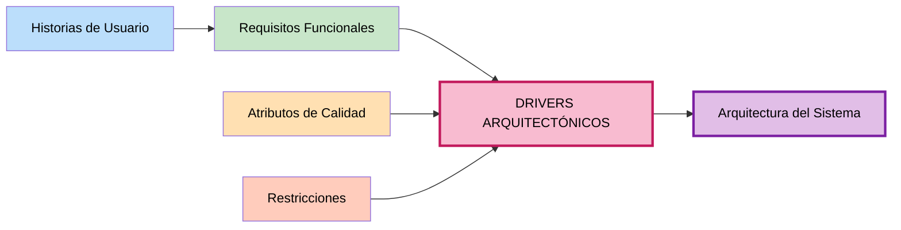

# Drivers Arquitectónicos — Marketplace de productos para mascotas

## Tabla de Drivers Arquitectónicos

| ID | Driver arquitectónico | Origen | ¿Por qué influye en la arquitectura? |
|---|---|---|---|
| **DA01** | El sistema debe soportar un incremento importante de usuarios durante campañas comerciales. | AC03 — Escalabilidad | Puede influir en la estrategia de escalamiento y despliegue. |
| **DA02** | El sistema debe mantener tiempos de respuesta adecuados durante una alta concurrencia. | AC01 — Rendimiento | Puede influir en la comunicación entre componentes, procesamiento y almacenamiento. |
| **DA03** | El sistema debe proteger los datos de usuarios y operaciones de compra. | AC04 — Seguridad | Puede influir en autenticación, autorización y protección de datos. |
| **DA04** | El sistema debe integrarse con una pasarela de pago externa mediante una API. | RC04 — Pasarela de pago | Condiciona la forma de comunicación e integración con servicios externos. |
| **DA05** | El sistema debe utilizar una API REST para la comunicación entre frontend y backend. | RC03 — API REST | Limita las alternativas de comunicación entre las partes del sistema. |
| **DA06** | El sistema debe desarrollarse con Node.js y PostgreSQL. | RC06, RC07 — Framework y BD | Define el stack tecnológico y las herramientas disponibles. |
| **DA07** | El sistema debe permanecer disponible durante campaña comercial. | AC02 — Disponibilidad | Influye en redundancia, recuperación ante fallos y estrategia de despliegue. |
| **DA08** | El sistema debe estar organizado de manera mantenible. | AC05 — Mantenibilidad | Influye en modularidad, separación de responsabilidades y documentación. |

---

## Matriz de relaciones
 

```mermaid
flowchart LR
    HU["Historias de Usuario"]
    RF["Requisitos Funcionales"]
    AC["Atributos de Calidad"]
    RC["Restricciones"]
    
    DA["DRIVERS ARQUITECTÓNICOS"]
    
    ARQ["Arquitectura del Sistema"]
 
    HU --> RF
    RF --> DA
    AC --> DA
    RC --> DA
    
    DA --> ARQ
 
    style HU fill:#bbdefb,color:#000
    style RF fill:#c8e6c9,color:#000
    style AC fill:#ffe0b2,color:#000
    style RC fill:#ffccbc,color:#000
    style DA fill:#f8bbd0,stroke:#c2185b,stroke-width:3px,color:#000
    style ARQ fill:#e1bee7,stroke:#7b1fa2,stroke-width:3px,color:#000
```

---

- **Escalabilidad:** Considerar load balancers, réplicas, caché
- **Rendimiento:** Optimizar queries, implementar índices, usar caché
- **Seguridad:** OAuth, JWT, HTTPS, encriptación, RBAC
- **Disponibilidad:** Redundancia, réplicas, health checks
- **Mantenibilidad:** Modularidad, documentación, pruebas, CI/CD

| Driver | Problema que plantea | Decisión que responde |
| :--- | :--- | :--- |
| **DA01- Escalabilidad** | Aumentarán usuarios en campañas | Monolito modular con posibilidad de escalamiento horizontal |
| **DA02- Rendimiento** | Habrá alta concurrencia | Incorporar caché y optimizar comunicación/procesamiento |
| **DA03 -Seguridad** | Hay datos sensibles | Autenticación y autorización |
| **DA04 - Pago externo** | Hay que comunicarse con una pasarela | Integración mediante API y adaptadores |
| **DA05 -API REST** | Frontend/backend deben comunicarse mediante REST | Separar interfaz y backend mediante API REST |
| **DA06 - Mantenibilidad** | Cambios no deben afectar otros módulos | Modularidad + Clean Architecture |
