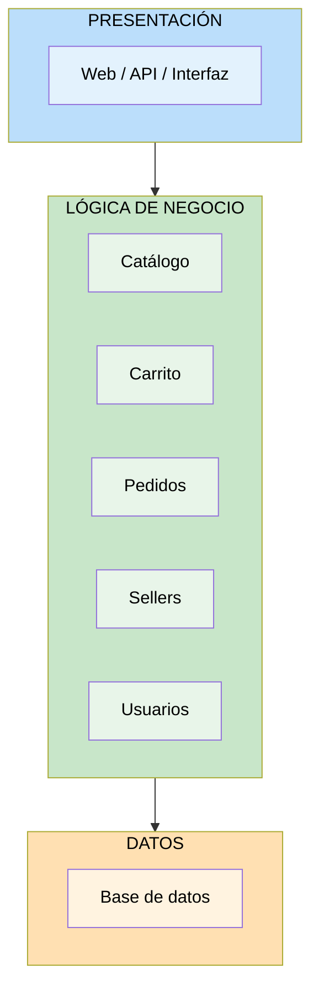
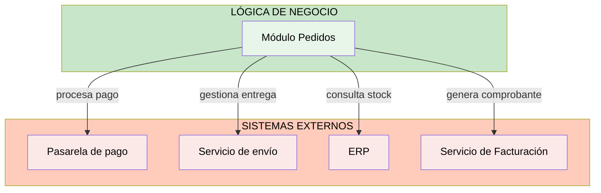

# Diseño Arquitectónico Inicial — Marketplace de productos para mascotas

## Objetivo
Organizar los módulos identificados anteriormente dentro de una primera propuesta de arquitectura, utilizando una **arquitectura de tres capas**.

## Definición

**Diseño de Arquitectura:** Es el proceso de organizar las principales partes del sistema y definir cómo se relacionan entre sí para cumplir con sus requisitos y responder a los atributos de calidad y restricciones. En este proceso se toman decisiones sobre cómo estructurar el sistema, cómo separar sus responsabilidades y cómo interactúa con otros sistemas externos.

---

## Arquitectura en Tres Capas

Cada capa tiene sus propias responsabilidades y se comunica únicamente con la capa inmediata inferior.

---

## Descripción de las Capas

| Capa | Pregunta que responde | Responsabilidades |
|---|---|---|
| **Presentación** | ¿Cómo interactúa el usuario? | Interfaz con el usuario (Frontend): páginas web, catálogos, carrito, login, panel admin. |
| **Lógica de negocio** | ¿Qué hace el sistema? | Reglas y procesos del sistema (Backend): validar compras, gestionar pedidos, procesar pagos. |
| **Datos** | ¿Dónde se almacena la información? | Almacenamiento de información (Base de datos): usuarios, productos, pedidos, stock, pagos. |

---

## Capa 1: Presentación 🖥️

**Responsabilidad:** Interfaz con el usuario (Frontend).

**Componentes:**
- Aplicación Web
- API REST (punto de entrada para las peticiones del frontend)

**Funcionalidades que expone:**
- Búsqueda y visualización de productos (catálogo)
- Gestión del carrito de compras
- Proceso de checkout y confirmación de pedido
- Login y gestión de sesión
- Panel de administración (para Administrador)
- Panel de gestión de productos (para Seller)

**Tecnología (según restricciones):**
- Frontend web responsivo
- Comunicación con el backend mediante API REST

---

## Capa 2: Lógica de Negocio ⚙️

**Responsabilidad:** Reglas y procesos del sistema (Backend).

**Módulos identificados:**

### Módulo Usuarios
- Registro y autenticación de clientes
- Gestión de perfil de usuario
- Control de acceso y roles (RBAC)

### Módulo Sellers
- Registro y gestión de sellers (RF07)
- Activación/desactivación de sellers
- Consulta de información de ventas

### Módulo Catálogo
- Búsqueda de productos (RF01)
- Consulta de información y disponibilidad (RF02)
- Registro y actualización de productos (RF03)

### Módulo Carrito
- Agregar, modificar y eliminar productos del carrito (RF04)
- Cálculo de totales

### Módulo Pedidos
- Generación de pedidos (RF05)
- Consulta de pedidos y su estado (RF06)
- Consulta de detalle de pedido (RF08)
- **Integración con sistemas externos:** Pasarela de pago, Servicio de envío, ERP

**Tecnología (según restricciones):**
- Node.js como runtime
- Exposición de servicios mediante API REST

---

## Capa 3: Datos 🗄️

**Responsabilidad:** Almacenamiento de información (Base de datos).

**Entidades principales:**
- Usuarios (clientes, sellers, administradores)
- Productos (catálogo)
- Carrito
- Pedidos
- Stock
- Pagos/transacciones

**Tecnología (según restricciones):**
- PostgreSQL como motor de base de datos

---

## Integración con Sistemas Externos

El módulo de **Pedidos** (dentro de la capa de Lógica de Negocio) se integra con los siguientes sistemas externos:

| Sistema externo | Propósito |
|---|---|
| **Pasarela de pago** | Procesar pagos de las compras. |
| **Servicio de envío** | Gestionar información de entrega de pedidos. |
| **ERP** | Proporcionar información de productos y stock. |
| **Servicio de Facturación** | Generar comprobantes de pago. |

---

## Justificación de la Arquitectura

### ¿Por qué tres capas?

1. **Separación de responsabilidades:** Cada capa tiene una única razón de cambio, facilitando el mantenimiento (AC05 — Mantenibilidad).
2. **Comunicación mediante API REST:** Cumple con la restricción RC03, permitiendo desacoplar frontend y backend.
3. **Escalabilidad independiente:** Cada capa puede escalar de forma independiente según la demanda (AC03 — Escalabilidad, DA01).
4. **Seguridad centralizada:** La lógica de negocio controla el acceso a los datos, permitiendo implementar autenticación y autorización de forma centralizada (AC04 — Seguridad, DA03).
5. **Integraciones aisladas:** Las integraciones con sistemas externos (pasarela de pago, ERP, envío) se manejan desde la capa de negocio, sin afectar la presentación ni los datos directamente.

### Relación con los Drivers Arquitectónicos

| Driver | ¿Cómo se refleja en esta arquitectura? |
|---|---|
| **DA01 — Escalabilidad** | Cada capa puede escalar de forma independiente (ej. más instancias del backend). |
| **DA02 — Rendimiento** | La capa de negocio puede implementar caché antes de llegar a la BD. |
| **DA03 — Seguridad** | Autenticación y autorización centralizadas en la capa de negocio. |
| **DA04 — Pasarela de pago** | Integración aislada en el módulo de Pedidos. |
| **DA05 — API REST** | La capa de presentación se comunica con la de negocio mediante API REST. |
| **DA06 — Stack tecnológico** | Node.js en la capa de negocio, PostgreSQL en la capa de datos. |
| **DA07 — Disponibilidad** | Separación de capas permite redundancia independiente por capa. |
| **DA08 — Mantenibilidad** | Módulos bien definidos (Catálogo, Carrito, Pedidos, Sellers, Usuarios) facilitan cambios aislados. |

---

## Próximos pasos

Esta primera propuesta de arquitectura en capas servirá de base para:

**Ejercicio 10:** Construir el diagrama final de arquitectura, incorporando actores, presentación, negocio, datos y sistemas externos en un solo diagrama completo.